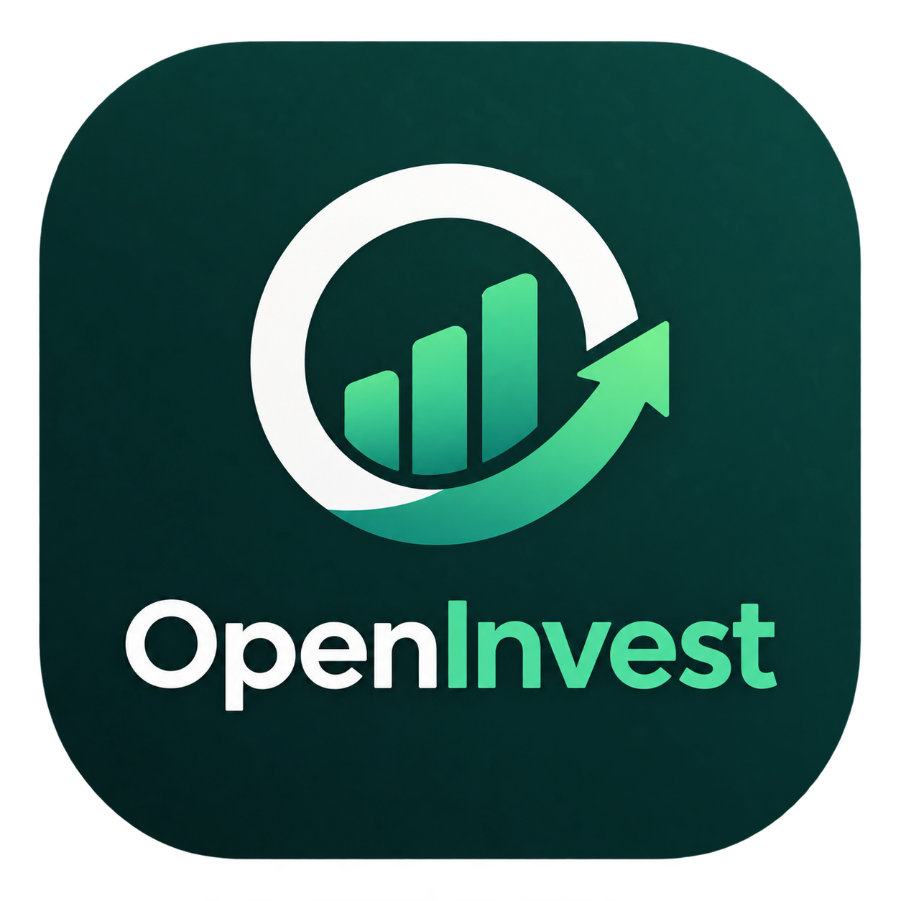

# OpenInvest

Aplicación de código abierto para la gestión de una cartera de fondos de inversión.

## Funciones principales

- **Búsqueda de Fondos**: Busca cualquier fondo de inversión del mundo utilizando su código ISIN. Obtenemos los datos en tiempo real a través de fuentes públicas financieras.
- **Historial de Precios**: Descarga el histórico de valores liquidativos (VL) para analizar la evolución temporal. Puedes seleccionar rangos de fechas personalizados.
- **Gestión de Operaciones**: Registra tus suscripciones (compras) y reembolsos (ventas). La aplicación calcula automáticamente tus participaciones totales y capital invertido.
- **Análisis de Rentabilidad**: Cálculo de índices avanzados para un análisis profesional:
  - **TAE**: Rentabilidad anualizada de tu bolsillo.
  - **TWR**: Rendimiento real del fondo (activo), eliminando el efecto de tus flujos de caja.
  - **MWR/TIR**: Tu éxito personal basado en el momento exacto de cada inversión.
- **Gráficos Interactivos**: Visualiza la evolución de tus fondos con filtros de rango rápido (1M, 6M, 1Y, ALL) y líneas de tendencia media.
- **Exportación e Importación**: Lleva tus datos contigo. Exporta e importa tus fondos y operaciones en formato JSON para moverlos entre dispositivos o hacer copias de seguridad.

## Información del Proyecto

- **Licencia**: Esta aplicación es Software Libre bajo la licencia GNU General Public License v3 (GPLv3).
- **Código Abierto**: El código fuente está disponible públicamente en nuestro repositorio de GitHub: [github.com/Webierta/openinvest](https://github.com/Webierta/openinvest)
- **Fuente de Datos**: Los datos financieros y cotizaciones se obtienen de Yahoo Finance a través de técnicas de scraping.
- **Privacidad y Seguridad**: OpenInvest es una aplicación 100% gratuita y sin publicidad. No recopilamos datos personales. Toda tu información financiera se guarda exclusivamente de forma local en tu dispositivo.
- **Garantía y Responsabilidad**: La aplicación se proporciona "tal cual", sin garantía de ningún tipo. No constituye asesoramiento financiero profesional. Invierte bajo tu propio riesgo.

## Plataformas soportadas

- **Android**
- **Linux (Desktop)**

---
Desarrollado por *Webierta*

