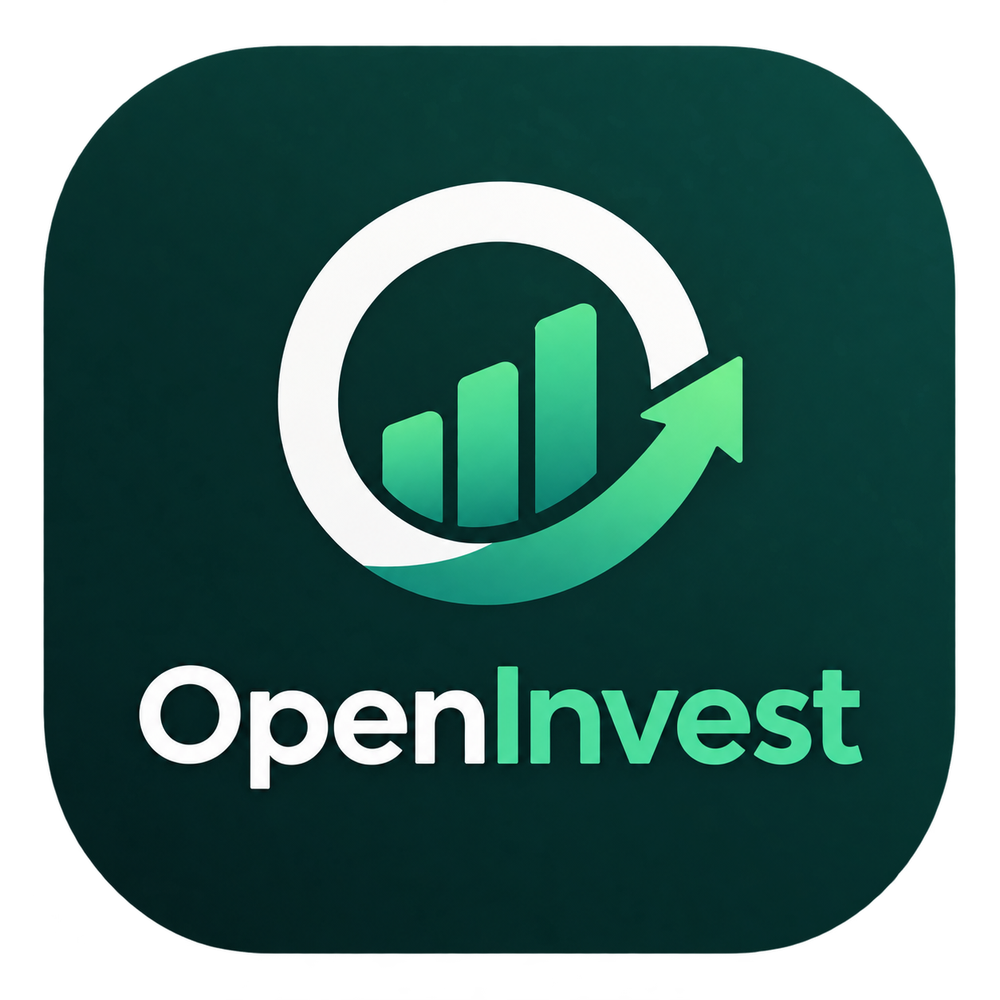

# OpenInvest


[](https://github.com/Webierta/openinvest/releases/)
[](https://github.com/Webierta/openinvest/blob/main/LICENSE)
[](https://github.com/Webierta/openinvest/issues)
[](https://apps.obtainium.imranr.dev/redirect?r=obtainium://app/%7B%22id%22%3A%22com.github.webierta.openinvest%22%2C%22url%22%3A%22https%3A%2F%2Fgithub.com%2FWebierta%2Fopeninvest%22%2C%22author%22%3A%22Webierta%22%2C%22name%22%3A%22OpenInvest%22%2C%22preferredApkIndex%22%3A0%2C%22overrideSource%22%3A%22GitHub%22%7D)

Aplicación de código abierto para la gestión de una cartera de fondos de inversión.

## Funciones principales

- **Búsqueda de Fondos**: Busca cualquier fondo de inversión del mundo utilizando su código ISIN. Obtenemos los datos en tiempo real a través de fuentes públicas financieras.
- **Historial de Precios**: Descarga el histórico de valores liquidativos (VL) para analizar la evolución temporal. Puedes seleccionar rangos de fechas personalizados.
- **Gestión de Operaciones**: Registra tus suscripciones (compras) y reembolsos (ventas). La aplicación calcula automáticamente tus participaciones totales y capital invertido.
- **Análisis de Rentabilidad**: Cálculo de índices avanzados para un análisis profesional:
  - **TAE**: Rentabilidad anualizada de tu bolsillo.
  - **TWR**: Rendimiento real del fondo (activo), eliminando el efecto de tus flujos de caja.
  - **MWR/TIR**: Tu éxito personal basado en el momento exacto de cada inversión.
- **Auditoría de Costes**: Introduce los Gastos Corrientes (TER) y la Comisión de Éxito de tus fondos para calcular la Ganancia Real neta, descontando el impacto de las comisiones en tu capital.
- **Gráficos Interactivos**: Visualiza la evolución de tus fondos con filtros de rango rápido (1M, 6M, 1Y, ALL) y líneas de tendencia media.
- **Mapa de Calor Mensual**: Analiza la estacionalidad de tus inversiones con una cuadrícula de rentabilidades mes a mes y acumulados anuales, identificando periodos de éxito y correcciones.
- **Comparación con Benchmarks**: Superpón la evolución de los principales índices mundiales (S&P 500, MSCI World, etc.) sobre el gráfico del fondo para medir su rendimiento relativo en porcentaje.
- **Comparador de Fondos**: Compara dos fondos de tu cartera lado a lado: evolución histórica con gráficos normalizados, comparativa de rentabilidades (1M, 6M, 1A, Total), volatilidad, costes (TER), rating Morningstar y posición de inversión personal.
- **Análisis de Riesgo**: Métricas de nivel profesional para evaluar la seguridad: Max Drawdown: La mayor caída histórica desde un pico. Recuperación: Tiempo que el fondo tarda en sanar sus pérdidas.
- **Exportación e Importación**: Lleva tus datos contigo. Exporta e importa tu cartera completa con fusión inteligente o fondos individuales en JSON para moverlos entre dispositivos.
- **Informes y Generación de Archivos**: Genera informes anuales profesionales en PDF con resumen ejecutivo y desglose por fondo, exporta un registro completo de tus operaciones en CSV, y protege tus datos con copias de seguridad.
- **Soporte Multidivisa**: Gestión automática de fondos en diversas divisas con conversión en tiempo real.
- **Notificaciones**: Recibe alertas configurables para estar al tanto de tus fondos y objetivos.


## Información del Proyecto

- **Licencia**: Esta aplicación es Software Libre bajo la licencia GNU General Public License v3 (GPLv3).
- **Código Abierto**: El código fuente está disponible públicamente en nuestro repositorio de GitHub: [github.com/Webierta/openinvest](https://github.com/Webierta/openinvest)
- **Fuente de Datos**: Los datos financieros, registros oficiales y cotizaciones se obtienen de diversas fuentes públicas, entre ellas la CNMV, el Banco Central Europeo (ECB/IFS), Morningstar y Yahoo Finance. OpenInvest no se responsabiliza de la exactitud de los datos proporcionados por terceros.
- **Privacidad y Seguridad**: OpenInvest es una aplicación 100% gratuita y sin publicidad. No recopilamos datos personales. Toda tu información financiera se guarda exclusivamente de forma local en tu dispositivo.
- **Garantía y Responsabilidad**: La aplicación se proporciona "tal cual", sin garantía de ningún tipo. No constituye asesoramiento financiero profesional. Invierte bajo tu propio riesgo.

## Plataformas soportadas

- **Android**
- **Linux (Desktop)**

### 🐧 Requisitos y Solución de Problemas en Linux

*OpenInvest* utiliza el almacenamiento seguro del sistema operativo para proteger tus preferencias de acceso. En Linux, esto depende de `libsecret` (GNOME Keyring o KWallet).

#### ¿La aplicación se cierra o no guarda la configuración de bloqueo en Linux?
Esto puede ocurrir en distribuciones Linux minimalistas o entornos de escritorio personalizados que no ejecutan un demonio de keyring (como `gnome-keyring` o `kwallet`) en segundo plano.

**Solución recomendada:** Asegúrate de tener instalado y en ejecución un gestor de claves. En la mayoría de las distribuciones basadas en Debian/Ubuntu, puedes instalarlo con:

```bash
sudo apt update
sudo apt install gnome-keyring
```

Y asegúrate de que tu entorno de escritorio inicie el demonio de keyring al arrancar.

**Mecanismo de Respaldo (Fallback)**: A partir de la versión actual, *OpenInvest* incluye un mecanismo de respaldo seguro. Si detecta que el almacenamiento seguro del sistema no está disponible, la aplicación no se bloqueará. En su lugar, cambiará automáticamente a un archivo local cifrado (AES) para guardar tus preferencias de acceso, garantizando que puedas seguir usando la aplicación sin interrupciones. 

> **Nota de seguridad**: Aunque el archivo de respaldo está cifrado, se recomienda encarecidamente usar un gestor de keyring nativo para obtener el máximo nivel de seguridad que tu sistema operativo puede ofrecer.


---
Desarrollado por *Webierta*
